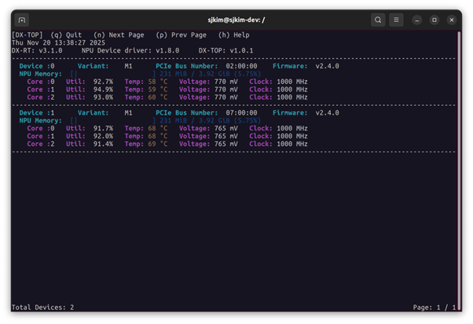

This chapter introduces the **DX-RT** command-line tools for model inspection, inference testing, and device management. These tools allow developers to validate models, measure performance, and control hardware directly from the terminal.  

These utilities are essential for validating model compilation, tuning inference performance, and maintaining the health and configuration of the underlying NPU hardware.

---

## Parse Model

This tool parses a compiled `.dxnn` model file and displays detailed information such as model structure, input/output tensors, and metadata.  

**Source**  
```
cli/parse_model.cpp
```

**Usage**  
```
parse_model -m <model_dir>
```

**Option**  
```
  -m, --model     model path
  -v, --verbose   show detailed task dependencies and memory usage
  -o, --output FILE   save the raw console output to a file (without color codes)
  -j, --json          extract JSON binary data (graph_info, rmap_info) to files
  -h, --help      show help
```

**Example**  
```
$./parse_model -m model.dxnn
```

---

## Run Model

This tool executes a compiled model to verify basic functionality, measure inference time, and optionally perform repeated runs for stress testing.


**Source**  
```
cli/run_model.cpp
```

**Usage**  
```
run_model -m <model_dir> -i <input_bin> -o <output_bin> -r <reference output_bin> -l <number of loops>
```

**Option**  
```
  -m, --model arg    Model file (.dxnn)
  -b, --benchmark    Perform a benchmark test (Maximum throughput)
                     (This is the default mode,
                      if --single or --fps > 0 are not specified)
  -s, --single       Perform a single run test
                     (Sequential single-input inference on a single-core)
  -v, --verbose      Shows NPU Processing Time and Latency
  -n, --npu arg      NPU bounding (default:0)
                       0: NPU_ALL
                       1: NPU_0
                       2: NPU_1
                       3: NPU_2
                       4: NPU_0/1
                       5: NPU_1/2
                       6: NPU_0/2
  -l, --loops arg    Number of inference loops to perform (default: 30)
  -t, --time arg     Duration of inference in seconds (benchmark and
                     target-fps mode, overrides --loops) (default: 0)
  -w, --warmup-runs arg  Number of warmup runs before actual measurement
                         (default: 0)
  -d, --devices arg  Specify target NPU devices.
                     Examples:
                       'all' (default): Use all available/bound NPUs
                       '0': Use NPU0 only
                       '0,1,2': Use NPU0, NPU1, and NPU2
                       'count:N': Use the first N NPUs
                       (e.g., 'count:2' for NPU0, NPU1) (default: all)
  -f, --fps arg      Target FPS for TARGET_FPS_MODE (default: 0)
                     (enables this mode if > 0 and --single is not set)
      --use-ort      Enable ONNX Runtime for CPU tasks in the model graph
                     If disabled, only NPU tasks operate
  -h, --help         Print usage
```

**Example**  
```
run_model -m /.../model.dxnn -i /.../input.bin -l 100
```

---

## DX-RT CLI Tool (Firmware Interface)

This tool provides a CLI for interacting with **DX-RT** accelerator devices, supporting device status queries, hardware resets, and firmware updates.

!!! note "NOTE"  
    This tool is applicable **only** for accelerator devices.  

**Usage**  
```
dxrt-cli <option> <argument>
```

**Option**  
```
  -s, --status             Get device status
  -i, --info               Get device info
  -m, --monitor arg        Monitoring device status every [arg] seconds 
                           (arg > 0)
  -r, --reset arg          Reset device(0: reset only NPU, 1: reset entire 
                           device) (default: 0)
  -d, --device arg         Device ID (if not specified, CLI commands will 
                           be sent to all devices.) (default: -1)
  -u, --fwupdate arg       Update firmware with deepx firmware file.
                           sub-option : [force:force update, unreset:device 
                           unreset(default:reset)]
  -g, --fwversion arg      Get firmware version with deepx firmware file
  -C, --fwconfig_json arg  Update firmware settings from [JSON]
  -v, --version            Print minimum versions
  -h, --help               Print usage
```

**Example**
```
dxrt-cli --status

dxrt-cli --reset 0

dxrt-cli --fwupdate fw.bin

dxrt-cli -m 1
```

---

## NPU Monitoring Utility

**DX-TOP** is a real-time command-line utility designed to monitor the status, utilization, and health metrics of Neural Processing Unit (NPU) devices managed by the DX-Runtime. It provides critical information necessary for performance tuning, debugging, and system health checks.

---

### Utility Versions (Header Information)

The top section of the screen displays the version of the core software components.

| Item | Description |
| --- | --- |
| **DX-RT** | **DX-Runtime Version.** The version of the core software stack that manages NPU operations.|
| **NPU Device Driver** | **NPU Driver Version.** The version of the operating system driver responsible for hardware communication.|
| **DX-TOP** | **Monitoring Tool Version.** The version of the DX-TOP utility itself. |

---

### Device Status Monitoring 

DX-TOP organizes information by individual NPU devices installed in the system. 

**Device Hardware Information**  
This section identifies the physical hardware and firmware configuration of the NPU card.  

| Item | Description |
| --- | --- |
| **Device ID** | The unique identifier assigned to the NPU card (e.g., 'Device :0'). |
| **Variant** | The model or variant of the NPU hardware (e.g., `M1`). |
| **PCIE Bus Number** | The PCI Express bus location of the device (e.g., `02:00:00`). This is crucial for hardware-level identification. |
| **Firmware** | The version of the embedded firmware running on the NPU hardware. |
| **NPU Memory** | The memory utilization of the on-board dedicated NPU memory. Displays Used MiB / Total GiB (Usage %). |

**Core Performance Metrics**  
Each device contains multiple processing Cores. This section displays real-time operational metrics for each core.  

| Item | Description |
| --- | --- |
| **Core ID** | The identifier for the individual processing core within the NPU (e.g., `Core :0`). |
| **Util** | **Utilization (Percentage).** The percentage of time the core is actively processing NPU tasks. High utilization (near 100%) indicates high workload. |
| **Temp** | **Temperature (Degrees Celsius).** The current operating temperature of the core. Critical for checking for overheating and thermal throttling. |
| **Voltage** | **Voltage (Millivolts).** The electrical voltage currently being supplied to the core. Reflects power management status. |
| **Clock** | **Clock Rate (Megahertz).** The current operating frequency of the core. Directly impacts processing speed and performance.|

<div class="center-text">
<p align="center">
  
<br>
Figure. Example of DX-TOP Monitoring Utility Screen 
<br><br>
</p>
</div>

---

### Command Controls (Help Menu) 

The following commands are available at the top of the DX-TOP interface for navigation and control.

| Command | Action |
| --- | --- |
| **(q) Quit** | Exits the DX-TOP application. |
| **(n) Next Page** | Navigates to the next page of device information (if more devices are present than can fit on one screen). |
| **(p) Prev Page** | Navigates to the previous page of device information. |
| **(h) Help** | Displays the help screen or a summary of available commands. |

---

## Performance Benchmarking Utility

The dxbenchmark tool is a CLI utility designed to automate the performance benchmarking of deep learning models and generate detailed, visualized reports.  

- **Comprehensive Execution:** Runs all detectable models in the target directory, including sub-directories (`via --recursive`).  
- **Detailed Reporting:** Generates a single, integrated HTML document with visualizations of key performance indicators (KPIs) and stability metrics.  
- **Stability Analysis:** Includes time-series data visualization (Performance Metrics Over Loops) and the Coefficient of Variation (CV) for jitter analysis.  
- **Raw Data for Comparison:** Outputs version-tagged JSON/CSV files for easy comparison across different Runtime and Driver versions.  

---

### CLI Guide

The benchmark tool is executed using the `dxbenchmark` command.
Running the build script `build.sh` creates the binary named `dxbenchmark` in `dx_rt/bin`.

```
DXRT v3.1.0 dxbenchmark
Usage:
  dxbenchmark [OPTION...]

      --dir arg          Model directory
      --result-path arg  Destination of result file (default: .)
      --sort arg         Sorting criteria
                           name: Model Name
                           fps: FPS
                           time: NPU Inference Time
                           latency: Latency (default: name)
      --order arg        Sorting order
                           asc: Ascending order
                           desc: Descending order (default: asc)
  -l, --loops arg        Number of inference loops to perform (default: 0)
  -t, --time arg         Time duration to perform (default: 0)
      --warmup arg       Warmup time (default: 10)
  -n, --npu arg          NPU bounding (default:0)
                           0: NPU_ALL
                           1: NPU_0
                           2: NPU_1
                           3: NPU_2
                           4: NPU_0/1
                           5: NPU_1/2
                           6: NPU_0/2
  -d, --devices arg      Specify target NPU devices.
                         Examples:
                           'all' (default): Use all available/bound NPUs
                           '0': Use NPU0 only
                           '0,1,2': Use NPU0, NPU1, and NPU2
                           'count:N': Use the first N NPUs
                           (e.g., 'count:2' for NPU0, NPU1) (default: all)
      --only-data        Make only data result (csv, json)
      --recursive        Search models recursively in subdirectories
                         (default: base directory only)
      --use-ort          Enable ONNX Runtime for CPU tasks in the model
                         graph
                         If disabled, only NPU tasks operate
  -v, --verbose          Shows NPU Processing Time and Latency
  -h, --help             Print usage
```

---

### Basic Usage and Syntax

The execution requires specifying the model source directory and one of the execution termination conditions (`-t` or `-l`).

**Execution Commands**  
After building, you can execute the tool directly using the dxbenchmark command without navigating into the dx_rt/bin directory.   

| Execution Method | Syntax | Description |
| --- | --- | --- |
| **Direct Path** | `./dx_rt/bin/dxbenchmark [OPTION...]` | Executes by directly specifying the path to the generated binary |
| **Direct Execute (Recommended)** | `dxbenchmark [OPTION...]`	 | Executes directly using the name registered in the environment |

**Mandatory Parameters**  

| Execution Method | Format | Description |
| --- | --- | --- |
| **Model Directory** | `./dx_rt/bin/dxbenchmark [OPTION...]` | The path to the directory containing the models. |
| **Termination Condition** | `-t {Time}` | Time duration in seconds. This option is currently prioritized over `-l.` |
| **Loop** | `-l {Loops}`	 | Number of inference loops.|


!!! note "NOTE"
    **Execution Termination Condition Priority**  
    Currently, the execution duration -t {Time} is prioritized . While running based on time is generally suitable for benchmarking, large variations in inference time between models can lead to distortion in graph results.  
     - `--dir {Directory}`: The path to the directory containing the models.  
     - `EITHER -t {Time}`: Time duration in seconds (takes precedence).  
     - `OR -l {Loops}`: Number of inference loops.  

**Execution Examples**
  
```
# Example 1: Run models in the 'models/' directory for 60 seconds  
./dxbenchmark --dir models/ -t 60  
 
# Example 2: Run recursively, sort by latency descending, target NPU 0 and 1  
./dxbenchmark --dir models/ --recursive --sort latency --order desc -d '0,1'  
```

---

### Output Files and Reporting

The tool generates a highly structured HTML report for visualization and version-controlled raw data files.  
 
**HTML Report Structure and Visualization**  

   - **Filename Format:** `DXBENCHMARK_{YYYY_MM_DD_HHMMSS}.html`  
   - **Example:** `DXBENCHMARK_2025_08_13_174251.html`  
  
**Raw Data Files**  

   - **Purpose:** To store the underlying data for version comparison and external analysis.  
   - **Filename Format:** `rt_{Runtime Version}_dd_{Device Driver Version}_pd_{PCIe Driver Version}.json/csv`  
   - **Example:** `rt_3.0.0_dd_1.7.1_pd_1.4.1.json`  

---
